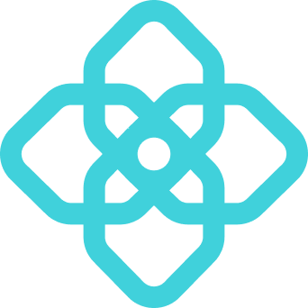

 

  

  <h3 align="center">OpenGradient</h3>

  

  OpenGradient is the leading research lab building at the frontier of AI and blockchain computing. We are building the world's leading decentralized network for verifiable AI computing: host models, run secure inference, and deploy agents onchain.
     
     
     
  

Building the future of verifiable AI with credibly-neutral infrastructure, verifiable computing infrastructure, and open and accessible models - empowering everyone to shape and own AI.

## Community

Visit our [Website](https://opengradient.ai)

Read [Documentation](https://docs.opengradient.ai)

Follow us on [Twitter](https://x.com/OpenGradient)

Join our [Discord](https://discord.gg/axammqTRDz)

Read our [blogs](https://opengradient.ai/blog)

<!--
**Here are some ideas to get you started:**

🙋‍♀️ A short introduction - what is your organization all about?
🌈 Contribution guidelines - how can the community get involved?
👩‍💻 Useful resources - where can the community find your docs? Is there anything else the community should know?
🍿 Fun facts - what does your team eat for breakfast?
🧙 Remember, you can do mighty things with the power of [Markdown](https://docs.github.com/github/writing-on-github/getting-started-with-writing-and-formatting-on-github/basic-writing-and-formatting-syntax)
-->
